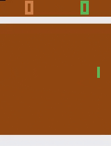
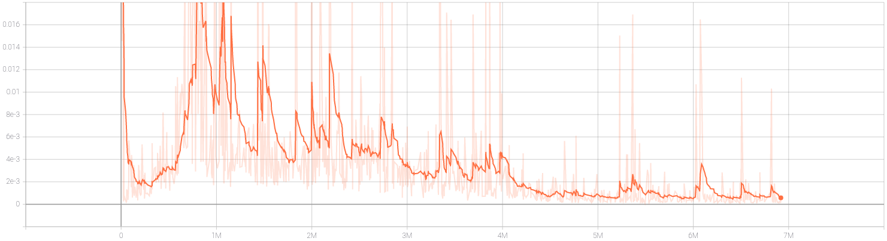
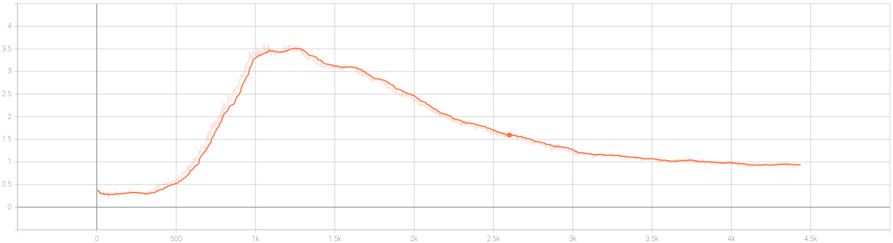

# RL Agent for Atari Pong

Implementation of [Playing Atari with Deep Reinforcement Learning](https://arxiv.org/abs/1312.5602).
This implementation additionally uses the "Double DQN" setup from the paper: [Deep Reinforcement Learning with Double Q-learning](https://arxiv.org/abs/1509.06461).

[OpenAI Gym](https://github.com/openai/gym)'s interface is used for the Atari Pong environment.
Frame skipping (4 frames by default) is done to speed up training.

## Training Details
For details on the approaches taken, please refer to the [original paper](https://arxiv.org/abs/1312.5602).
For details on the Double DQN approach, please refer to the [Double DQN paper](https://arxiv.org/abs/1509.06461).

### Architecture
The network architecture is sequential, and consists of the following layers:
1. 2D convolution layer: 16 output channels, 8x8 filters, stride 4, no padding
2. ReLU activation
3. 2D convolution layer: 16 output channels, 8x8 filters, stride 4, no padding
4. ReLU activation
5. Fully connected layer: 256 outputs
6. ReLU activation
7. Fully connected layer: 6 outputs (which is the action space size)

All weights are initialized using Keras's VarianceScaling initializer with a scale of 2.0, to mimic the original code.
All biases are initialized with zeros.

### Replay Buffer
The replay buffer for experience replay is implemented using a custom class that uses Python's list.
The class definition is present in the file: [utils.py](https://github.com/rharish101/PongRL/blob/master/utils.py#L12).
This class is made to take advantage of fast random accesses of lists, which is used during random sampling, and implements a limit on the length of the list.

Each element of the replay buffer contains the following:
* An input states (of 4 encountered frames ie. excluding skipped frames) as a 3D uint8 tensor
* The action taken by the agent on this input state, as an int
* The reward received due to the above action, as a float
* The next encountered frame (not state), as a result of the above action, as a 2D uint8 tensor
* A flag which signifies whether the episode terminated after the above action or not, as a bool

### Policies
The target policy is a greedy policy.
The behaviour policy is an epsilon greedy policy.

The value of epsilon for the behaviour policy is kept constant at the initial value for a few episodes before being decayed to a minimum.
This decay is a linear decay that is applied at the end of every episode.

### Loss
The loss that is optimized is the Huber loss between the target Q-values and the predicted Q-values.
This loss is used as it is less sensitive to large errors than MSE (Mean Squared Error).
At the same time, it provides better gradients for lower values of the error than MAE (Mean Absolute Error).

The original implementation uses the RMSProp optimizer, whereas this implementation uses the Adam optimizer.
The learning rate is kept constant throughout the training process.

### Logging
The following details are logged during training:
1. Videos of the agent playing against the CPU. Each video contains a single episode. This is logged every few episodes.
2. The loss at one step. This is logged every few steps.
3. The maximum Q-value, ie. value function, for the state seen at the start of an episode. This is logged every few episodes.

## Instructions

### Setup
[Poetry](https://python-poetry.org/) is used for conveniently installing and managing dependencies.

1. *[Optional]* Create and activate a virtual environment with Python >= 3.8.

2. Install Poetry globally (recommended), or in a virtual environment.
    Please refer to [Poetry's installation guide](https://python-poetry.org/docs/#installation) for recommended installation options.

    You can use pip to install it:
    ```sh
    pip install poetry
    ```

3. Install all dependencies with Poetry:
    ```sh
    poetry install --no-dev
    ```

    If you didn't create and activate a virtual environment in step 1, Poetry creates one for you and installs all dependencies there.
    To use this virtual environment, run:
    ```sh
    poetry shell
    ```

#### For Contributing
[pre-commit](https://pre-commit.com/) is used for managing hooks that run before each commit, to ensure code quality and run some basic tests.
Thus, this needs to be set up only when one intends to commit changes to git.

1. Activate the virtual environment where you installed the dependencies.

2. Install all dependencies, including extra dependencies for development:
    ```sh
    poetry install
    ```

3. Install pre-commit hooks:
    ```sh
    pre-commit install
    ```

**NOTE**: You need to be inside the virtual environment where you installed the above dependencies every time you commit.
However, this is not required if you have installed pre-commit globally.

### Training
Run `train.py`:
```
./train.py
```

Values for hyper-parameters can be specified from the commandline.
The training script uses Python's argparse to parse commandline arguments.
For info, refer to the help info that can be obtained using:
```
./train.py --help
```

Since the training can take hours or days, functionality is provided for stopping and resuming progress.
Press "Ctrl-C" to send a keyboard interrupt to the training script to stop training and save the models and some training parameters.
The trained model is saved in TensorFlow's ckpt format (to the directory given by the `--save-dir` argument).

Progress can be resumed using the `--resume` option as follows:
```
./train.py --resume
```
The model will load data from the location where data is saved (from the directory given by the `--save-dir` argument).

### Testing
Run `test.py`:
```
./test.py
```

The testing script uses Python's argparse to parse commandline arguments.
For info, refer to the help info that can be obtained using:
```
./test.py --help
```

The trained model will be loaded from the directory given by the `--load-dir` argument.
The output will be a video saved into the directory given by the `--log-dir` argument.

## Results

### Video


This video is sped up to optimize the GIF.

### Metrics
#### Loss


#### Max Q-value

